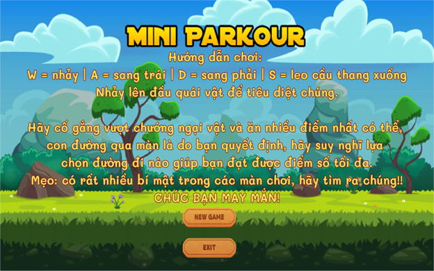
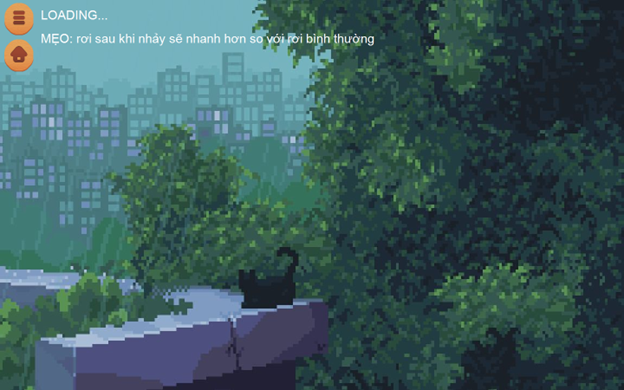
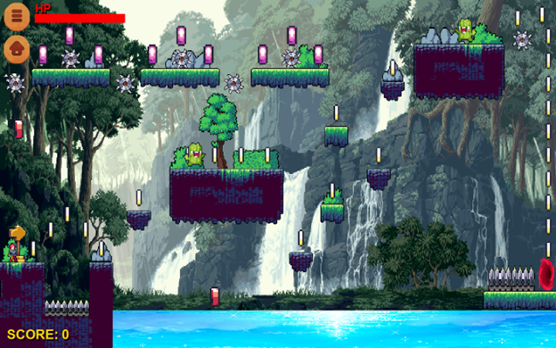
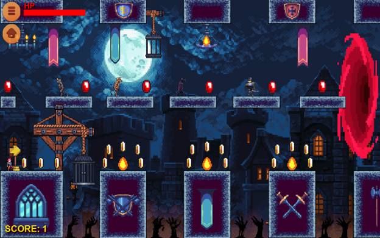
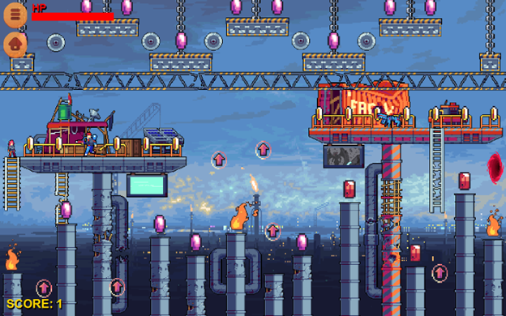
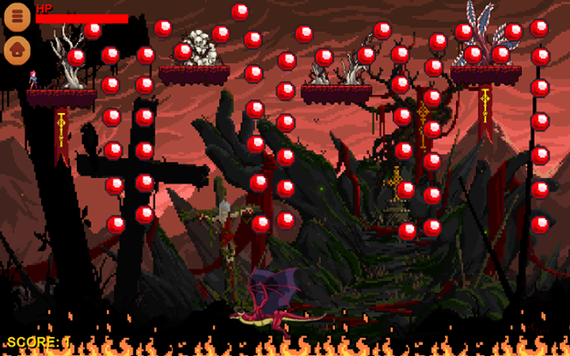

# 🎮 IT008 - ĐỒ ÁN LẬP TRÌNH TRỰC QUAN

## 📝 Giới thiệu dự án
* **Tên dự án:** Xây dựng trò chơi vượt ải
* **Môn học:** Lập trình trực quan (IT008)
* **Nhóm thực hiện:** Nhóm 4
* **Nền tảng:** Windows Forms (C#)

---

## 📸 Hình ảnh Demo
### 🖥️ Giao diện chính & Màn hình chờ
| Màn hình chính | Màn hình chờ (Loading) |
| :---: | :---: |
|  |  |

### 🕹️ Trải nghiệm trong Game
| Map 1: Rừng rậm |
| :---: |
|  |
| Map 2: Lâu đài hắc ám |
| :---: |
|  |
| Map 3: Nhà máy |
| :---: |
|  |
| Map 4: Rừng quỷ (Map Boss) |
| :---: |
|  |
---

## ✨ Các tính năng chính
Dựa trên cấu trúc code, dự án bao gồm các tính năng:
- [x] **Hệ thống Menu:** Giao diện chính (`MainMenuForm`) chuyên nghiệp với các lựa chọn chơi game, hướng dẫn.
- [x] **Hệ thống màn chơi (Levels):** Thiết kế nhiều màn chơi từ dễ đến khó (`MapLevel1` đến `MapLevel4`).
- [x] **Màn chơi Boss:** Map cuối (`MapLevel4`) với độ khó đặc biệt.
- [x] **Cơ chế Game:** - Hệ thống bẫy (`trap`) và vật phẩm thu thập (`coin`).
  - Màn hình chờ (`loading_screen`) khi chuyển cảnh.
- [x] **Tính năng bổ trợ:** Hỗ trợ phím tắt (phím F bật full màn hình, Esc để thoát).

---

## 🛠 Công nghệ & Thư viện
* **Ngôn ngữ:** C#
* **Framework:** .NET Framework
* **Công cụ:** Visual Studio 2022
* **Tài nguyên:** Sử dụng hệ thống `Images` và `Resources` riêng biệt trong project.

---

## 🚀 Hướng dẫn chạy đồ án
1. **Tải về:** Nhấn nút `Code` -> `Download ZIP`.
2. **Mở Project:** Mở file `LapTrinhTrucQuangProjectTest.sln` bằng Visual Studio 2022.
3. **Chạy:** Nhấn `F5` để xem các màn chơi đã hoàn thiện.

## 👥 Thành viên thực hiện
| MSSV | Họ và tên | Vai trò |
| :--- | :--- | :--- |
| **24521310** | **Nguyễn Thành Phát** | Code Main Menu, nút bấm, code logic game, thiết kế  |
| **24521605** | **Lê Trần Quang Thắng** | Phát triển ý tưởng design, code logic game, thiết kế UI |
| **24521900** | **Tô Quang Trường** | Trưởng nhóm, Thiết kế UI, code logic game |
